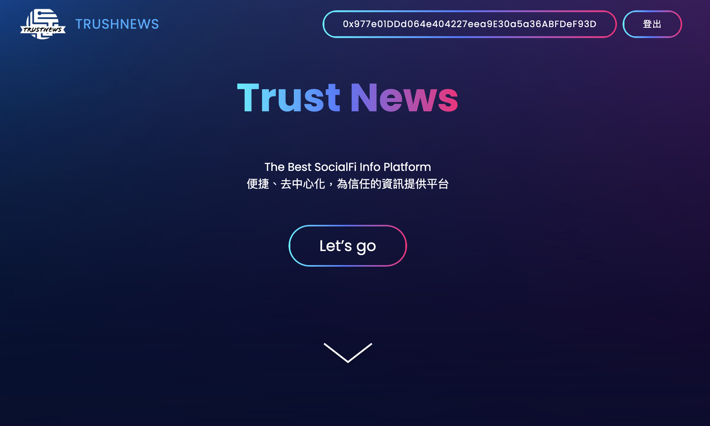
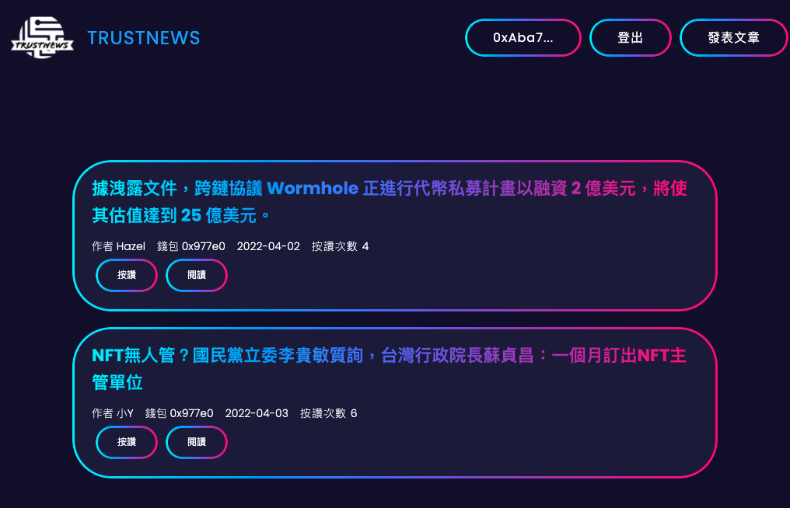

<h1 align="center">
  🦄 TrustNews Dao
</h1>
<p align="center">The Best Socialfi News Platform</p>
<p align="center">便捷、去中心化，為值得信任的資訊提供平台</p>

<p align="center">
  
  
</p>
<p align="center">
    <a href="https://hazelwu2.github.io/kcrypto-camp-final-project-team/" target="blank">Online Demo</a>
    ·
     <a href="https://ho-msho.gitbook.io/untitled/" target="blank">白皮書</a>
    ·
    <a href="https://www.figma.com/file/dmekLLaoDZx0mD3BkL4Uoz/KcryptoCamp-TrustNews-Dao?node-id=17%3A3">Figma</a>
    ·
    <a href="https://whimsical.com/team-6-Y2HMTy6LPtn1fpnQtt3XWu">Whimsical</a>
</p>
為了解決傳統媒體的信任機制，以及Web3資訊過量，難以取得正確且即時的重要訊息。<br>
TrustNews Dao 是基於web3社群機制的鏈上媒體平台，希望同時解決傳統媒體平台資訊難以朔源，而提供正確有效的媒體人、KOL難以將資訊的分享直接變現，同時用戶可以藉由此平台輕鬆追蹤web3每天發生的大小事，畢竟幣圈一天人間一年，希望靠著系統性的整理資訊，提供資訊傳遞者適當的報酬，創造一個用戶可以信任，資訊傳遞者可以獲得回報的一個web3資訊交流平台。
<br>
嘗試利用代幣經濟製造一個用用戶與社群間的正向互動模式，並且藉由去中心化自治的途徑，逐步發展成為值得信任的自治性組織TrustNews Dao。


## 🛠️ 開發
本專案分為 Solidity 智能合約、前端開發。
- 智能合約：scaffold-eth/packages/hardhat
- 前端Dapp：frontend

### Dapp
Install
```
$ cd frontend
$ yarn install && yarn start
```
📱 開啟 http://localhost:3000，便可看到 Dapp 開發環境
👨🏼‍💻 開啟 .env 設定 REACT_APP_INFURA_ID，可到 [Infura](https://infura.io/) 申請 Project 取得 ID

Build
```
$ yarn deploy
```
👨🏼‍💻 部署設定 `package.json` 設定 `homepage` 成 GithubPage 網址
👨🏼‍💻 根據專案編譯後的 `build` 資料夾，部署到 remote hazel，開啟 `frontend/package.json` 找到 `scripts.deploy` 將 `--repo hazel` 改成你要 deploy 的 repo

### Solidity
Install
```
$ cd scaffold-eth
$ yarn install
$ yarn upload
$ yarn chain
```


Deploy Contract
```
$ yarn compile
$ yarn deploy
```
### Develop Contract & Test Connect Contract in Dapp
開發合約及部署，最後在 Dapp 調試步驟

```
1. 在 `scaffold-eth/packages/hardhat/contracts` 新增合約 xxx.sol
2. 在 `scaffold-eth/packages/hardhat/deploy` 新增部署
3. $ yarn deploy
4. `frontend/config/contract.js` 引入合約 Address 及 abi json
5. 在 Dapp `frontend/src/components/GetToken.tsx` 進行串接調試合約
```

## Reference
本專案使用到以下工具
- [Hardhat](https://hardhat.org/getting-started/)
- [React Hook Wagmi](https://wagmi.sh/)
- [Scaffold-Eth](https://github.com/scaffold-eth/scaffold-eth)
- [IPFS](https://ipfs.io/)

## 編輯歷程

|版本|編輯時間|編輯人|說明|
|:---|:---|:---|:---|
|v1|2022/04/04|Hazel|Readme加上環境安裝指令|
|v0|2022/03/13|Osmond|白皮書初版|


----

## Purpose


----

# RoadMap

:::info
phase 1
:::


### 可信任的資訊提供平台

建立具有媒體認證機制的撰文平台，提供媒體人，KOL建立個人風格的撰文平台，且容易分類，追蹤系列撰文。例如可建立：BAYC系列、CloneX系列、以太幣交易系列、網格交易系列...等等，使得資訊方容易管理，閱讀方容易跟隨系列文章。
    
### 代幣政策

同時，建立平台代幣 TNC(TrustNews Coin)與治理代幣 TDC(TrustNews Dao Coin)雙幣政策，資訊提供方可以藉由撰文獲取基本的TNC代幣，並可藉由讀者對於文章的傳閱次數以及按讚、拍手數量得到等比例的TNC與TDC代幣發放，而用戶方在此平台可以獲得基本的免費按讚次數給予提供資訊的撰文者獎勵，同時也可以藉由定期訂閱平台、贊助平台獲得平台代幣TNC, 並且可用於給予資訊提供方更多鼓勵，在給予資訊提供者鼓勵的同時也會得到治理代幣 TDC。

### 平台代幣 TNC 的取得與用途:

藉由訂閱贊助平台金庫，等比例鑄造出相應數量的 TDC。可用於贊助訂閱資訊提供方，以及購買、競標每期 TrustNews Dao 所投票選出的優秀文章,資訊所做成的NFT，用以紀念每期間的優質文章，同時也會轉以一定比例回饋給撰文方。

### 治理代幣 TDC 的取得與用途：

撰文者可以藉由資訊的提供與傳閱的數量還有閱讀方的按讚取得，讀者可以藉由閱讀完文章並且對文章互動時獲得。治理代幣 TDC 可用於平台有重大決策時行使*投票權，以及定期票選優秀文章資訊作為平台紀念NFT。
        *投票採平方投票法，避免巨鯨干擾，同時可以轉讓給予信任者的代理制度
       
### 紀念NFT用途
    
由 TrustNews Dao定期投票選出的紀念性NFT，用以提供競標來回饋重大消息提供者，同時NFT持有人也能夠享有此篇重要貼文後續的分潤，用以鼓勵資訊傳播以及早期支持者。 
    
---

:::info
phase 2
:::

### 串連web3平台

在平台建立，以及有足夠品質與數量的文章資訊開始進駐以後，同步會建立web3最常用的discord，twitter平台，除了會在上面提供文章資訊的分享外也會建立各大項目頻道用來分類以及追蹤，還有提供web3用戶一個方便在一個一個項目中沈浮的同時有一個即時的資訊獲取平台。
    同時也會跟各大項目合作，爭取開啟專屬平台用以追蹤本群組所提供的精選文章，讓各大社群用戶在自己所屬的社群互動的同時也不會錯過任何重大消息。

### 建立互動式平台

有了起初的單項資訊傳播平台，閱讀方可以藉由閱讀以及按讚與撰文者互動，下一階端我們將建立一個擁有更具有互動性的社交性平台，除了原先的文章陳列頁面，還會增加可以跟作者互動的區塊，方便作者與讀者之間直接的討論與解釋。進一步加強雙方跟平台之間的連結性。

### 開啟撰文者權限

由起初試營運邀請制撰文者逐步開放到自由申請制，只要提供可追溯錢包及基礎身份認證，就能在平台上開啟個人的撰文頁面，建立人人都能提供資訊的平台，同時平台以及 DAO 也會開始增加審核評審，以確保資訊正確性，以及文章的互動不止按讚以外還可以有懷疑的選項，使得不確定的資訊可以即時的被發現，不會只是一昧的傳播。
    
### 建立更完善的項目分類

除了提供項目提供者過去的文章資訊分類，還可以提供縱向的管理，例如：從原本的 KOL A底下的 CloneX 系列撰文，轉變至可以提供任何 CloneX 同時期的相關的文章，方便用以交叉比對資訊。
    
--- 
  
:::info
phase 3
:::

### 建立聊天討論區

當社群成長到一定程度，主軸不光是圍繞撰文者，平台方將會建立討論區，一般用戶之間也能在其中互相討論交流。從社群間的交流以及互動，提升對於平台的適用頻率以及黏著度。

### 降低項目方實際作用

推動社群走向更近一步去中心化形式，透過逐步提升 DAO 決議項目，以及降低項目方對於社群發展的規劃力度，同時開始從社群中挑選MOD維護社群運作。
    

---

:::info
phase 4
:::


### TrustNews Dao 完全自治
### 下台一鞠躬


## [🧐 更多說明](https://github.com/Inprohub/h5_gioco_plus_frontend_2.0/wiki)
###### tags: `期末報告`
